## Table of Contents

-  [Experience the Project](#experience-the-project-for-yourself)
-  [Project Demonstration](#project-demonstration)
   -  [Web Server](#1-web-server)
      -  [PC Device](#11-pc-device)
      -  [Mobile Device](#12-mobile-device)
   -  [Local Server](#2-local-server)
      -  [PC Device](#21-pc-device)
-  [Project Development](#project-development)
   -  [Database Schemes](#database-schemes)
   -  [Work Diary](#work-diary)
-  [API Documentation](#api-documentation)
   -  [Generate Dataset](#1-generate-dataset)
   -  [Get Customers](#2-get-customers)
   - [Conduct Clustering](#3-conduct-clustering)
   - [Get Customers by Cluster](#4-get-customers-by-cluster)
   - [Get Clusters Amounts](#5-get-clusters-amounts)
   - [Get Income And Loan by Cluster](#6-get-income-and-loan-by-cluster)
   - [Generate Product Dataset](#7-generate-product-dataset)
   - [Get Products](#8-get-products)
   - [Conduct Product Match](#9-conduct-product-match)
   - [Get Products By Cluster](#10-get-products-by-cluster)
   - [Select Product By Id](#11-select-product-by-id)
   - [Drop Table](#12-drop-table)
- [Schedule Documentation](#schedule-documentation)
   - [Every Hour](#1-every-hour)
- [Project Design](#project-design)
   - [Work Flow & Wireframe](#1-work-flow--wireframe)
   - [Prototype: Figma](#2-prototype-figma)
- [Appendixes](#appendixes)
   - [Localhost Demo](#1-localhost-demo)
      - [Dataset Generation](#11-dataset-generation)
      - [K-Means Clustering](#12-k-means-clustering)
      - [Home Page Demo](#13-home-page-demo)
      - [Select & Result (partial) Page Demo](#14-select--resultpartial-page-demo)
      - [Result Page Demo: Cluster insights and cluster assignments](#15-result-page-demo-cluster-insights-and-cluster-assignments)
      - [Result Page Demo: Overall and cluster assignments](#16-result-page-demo-overall-and-cluster-assignments)
      - [Result Page Demo: Overall and recommended products](#17-result-page-demo-overall-and-recommended-products)
      - [Send Email Demo: Selected cluster and product info, the email form](#18-send-email-demo-selected-cluster-and-product-info-the-email-form)

## Experience the project for yourself!
🔗 Tap the link and give it a go 👉 **[https://www.samanthawhee.com/customer_segmentation/](https://www.samanthawhee.com/customer_segmentation/)**

## Project Demonstration

### 1. Web Server
#### 1.1 PC Device

#### 1.2 Mobile Device

### 2. Local Server
#### 2.1 PC Device

## Project Development
### Database Schemes
<table>
  <tr>
    <th>Table</th>
    <th>Column Name</th>
    <th>Data Type</th>
    <th>Constraints / Description</th>
  </tr>

  <!-- customers -->
  <tr>
    <td rowspan="11">customers</td>
    <td>id</td>
    <td>SERIAL</td>
    <td>PRIMARY KEY</td>
  </tr>
  <tr><td>first_name</td><td>TEXT</td><td>NOT NULL</td></tr>
  <tr><td>last_name</td><td>TEXT</td><td>NOT NULL</td></tr>
  <tr><td>age</td><td>INT</td><td>Non-negative</td></tr>
  <tr>
    <td>occupation</td>
    <td>INT</td>
    <td>
      - 0: Student 
      - 1: Salaried Employee 
      - 2: Self-Employed 
      - 3: Business Owner 
      - 4: Retired 
      - 5: Unemployed 
      - 6: Homemaker 
      - 7: Freelancer 
      - 8: Contractor 
      - 9: Government Employee
    </td>
  </tr>
  <tr>
    <td>city</td>
    <td>INT</td>
    <td>
      - 0: Belfast 
      - 1: Birmingham 
      - 2: Bristol 
      - 3: Cardiff 
      - 4: Edinburgh 
      - 5: Glasgow 
      - 6: Leeds 
      - 7: Leicester 
      - 8: Liverpool 
      - 9: London 
      - 10: Manchester 
      - 11: Newcastle 
      - 12: Nottingham 
      - 13: Sheffield 
      - 14: Southampton
    </td>
  </tr>
  <tr><td>annual_income</td><td>DECIMAL(12,2)</td><td>Non-negative</td></tr>
  <tr><td>annual_spending</td><td>DECIMAL(12,2)</td><td>Non-negative</td></tr>
  <tr><td>loan_balance</td><td>DECIMAL(12,2)</td><td>Non-negative</td></tr>
  <tr><td>credit_score</td><td>INT</td><td>Typically 0–850</td></tr>
  <tr><td>cluster</td><td>INT</td><td>Cluster assignment</td></tr>

  <!-- products -->
  <tr>
    <td rowspan="22">products</td>
    <td>id</td>
    <td>SERIAL</td>
    <td>PRIMARY KEY</td>
  </tr>
  <tr><td>product_id</td><td>INT</td><td>Unique product identifier</td></tr>
  <tr><td>product_name</td><td>VARCHAR(100)</td><td>Name of the product</td></tr>
  <tr><td>product_type</td><td>VARCHAR(50)</td><td>Type/category of the product</td></tr>
  <tr><td>eligibility_criteria</td><td>JSON</td><td>Eligibility rules</td></tr>
  <tr><td>min_age</td><td>INT</td><td>Minimum age</td></tr>
  <tr><td>max_age</td><td>INT</td><td>Maximum age</td></tr>
  <tr><td>min_income</td><td>DECIMAL(12,2)</td><td>Minimum income</td></tr>
  <tr><td>max_income</td><td>DECIMAL(12,2)</td><td>Maximum income</td></tr>
  <tr><td>credit_score_required</td><td>INT</td><td>Minimum credit score</td></tr>
  <tr><td>interest_rate</td><td>DECIMAL(5,2)</td><td>Interest rate</td></tr>
  <tr><td>annual_fees</td><td>DECIMAL(10,2)</td><td>Annual fees</td></tr>
  <tr><td>risk_level</td><td>VARCHAR(10)</td><td>Risk category</td></tr>
  <tr><td>benefits</td><td>TEXT</td><td>Description</td></tr>
  <tr><td>term_length</td><td>INT</td><td>Term in months/years</td></tr>
  <tr><td>renewable</td><td>BOOLEAN</td><td>TRUE if renewable</td></tr>
  <tr><td>reward_points</td><td>DECIMAL(10,2)</td><td>Reward points</td></tr>
  <tr><td>product_status</td><td>VARCHAR(20)</td><td>Status of product</td></tr>
  <tr><td>launch_date</td><td>DATE</td><td>Launch date</td></tr>
  <tr><td>cluster</td><td>INT[]</td><td>Cluster IDs</td></tr>
  <tr><td>score</td><td>DECIMAL(5,3)</td><td>Product score</td></tr>
  <tr><td>channels</td><td>TEXT[]</td><td>Array of channels where the product is available</td></tr>
</table>

### Work Diary
| Date       | Frontend | Backend |
|------------|---------|---------|
| 14 Nov 2025 |- Adjust the CSS for the width under 400px and under 600px|- `scheduler.start()` : Drop tables every hour|
| 13 Nov 2025 | - Call `dropTable(tableName)` after sending email - Embed Google Analytics code - Fix the bug that fetching product is ahead of product matching - Portfolio: Make the cover image for the customer segmentation section | - `.env.local`: Add `DATABASE_URL` and `ENV` - `dropTable(tableName)` - Optimise the speed of customer dataset generation |
| 8 Nov 2025 | - `.env.development` - `.env.production` - Change fetch URL to variable + API route | - `.env.development` - `.env.production` - Change database route for customer, product, and engine generation - Change `DATA_PATH` to local and cloud - **Cloud Server: Render** &nbsp;&nbsp;- Create new cloud server and database &nbsp;&nbsp;- Set up environment variables (`ENV`, `DATA_PATH`, `DATABASE_URL`) |
| 7 Nov 2025 | - Add `Copyright.js` to each page - Add `Final.js` page - Integrate the EmailJS third-party service - Sort the CSS code | - |
| 6 Nov 2025 | - `GetProductsByCluster.js` - `Product.js`: Call `getProductsByCluster()` - Sort CSS for product table and send email page - Add `score` attribute on product table - Navigate from notification button to send email page - Carry cluster data and `product_id` - Call `getProductsById()` | - `getProductsByCluster()` - `getProductsById()` |
| 4 Nov 2025 | - Add `benefits`, `score` attribute on the table - Integrate product match API | - `conductProductMatch()` - Add `cluster` and `score` attributes in product table |
| 3 Nov 2025 | - `ScatterPlot.js` - `Radar.js` - Edited `Table.css` - `Product.js` - `ProductTable.js` | - `getIncomeAndLoanByCluster()` - `generateProductDataset()` - `getProducts()` |
| 2 Nov 2025 | - `Pie.js` | - `getClustersAmounts()` |
| 1 Nov 2025 | - Show different cluster assignments by clusters - Record toggled data and pass to Result page - Show toggled data on cluster assignments - Add charts to the overall | - Database order issue after inserting cluster data |
| 31 Oct 2025 | - Sorted components - `Result.js`: Done layout - Switch clusters - `ClusterButton.js` - `ClusterInsight.js` - `Assignment.js` - `AssignmentTable.js`: Fetch clustered data | - Added `cluster` attribute to database - Separate fetch functions into `FetchData.py` - `FetchData.py`: `fetchCustomersByCluster()` - `KMeansClustering.py`: `insertClusterResults(dataframe)` |
| 30 Oct 2025 | - Managed `Table.css` style - `Table.js`: Added function to count toggled data and activate/inactivate Run Clustering button | - |
| 29 Oct 2025 | - Studied frontend/backend contract - Separated APIs: `home()`, `generateDataset()`, `getCustomers()`, `conductClustering()` - Call APIs: `generateDataset()`, `getCustomers()` - Select Page / Select Introduction / Return Home button - Run clustering layout only - Display data | - |
| 28 Oct 2025 | - Restructured file system: Home, Components, Select | - |
| 27 Oct 2025 | - `Home.js`, `Home.css`, `Select.js`: Finished Home Page | - |
| 28 Sep 2025 | - Updated UI/UX - Uploaded UI/UX images and prototype video to GitHub | - |
| 27 Sep 2025 | - Learnt React: `App.js`, `index.js`, component functions - Completed UI/UX design and prototype in Figma | - |
| 25 Sep 2025 | - | - `generateRandomString()`: moved from `main.py` to `DataGenerator` - `pickFirstName()`: done - `pickLastName()`: done - `executeDataGeneration()`: generate multiple datasets at once - `KMeansClustering()`: applied K-Means to dataset |
| 14 Aug 2025 | - | - `createSqlFile()`: create `.sql` file - `createTable(tableName, file_path)`: create query content - `executeSqlFile(file_path)`: execute `.sql` file |
| 12 Aug 2025 | - Frontend: JavaScript with React - Setup: `npm start` at `http://localhost:3000` | - Backend: Python, Flask, RESTful API - Database: PostgreSQL - Setup: Backend queries at `http://localhost:5000/api/customers` |

## API Documentation
### 1. Generate Dataset
- URL: /generateDataset
- Method: POST
- Description: Generates a new customer dataset in the database.
- Request Body: None
- Response:
<pre>{
  "message": "Dataset generated successfully."
}</pre>
- HTTP Status Codes:
  - 200 OK 
  - 500 Internal Server Error
- cURL:
<pre>curl -X POST http://localhost:5000/generateDataset</pre>
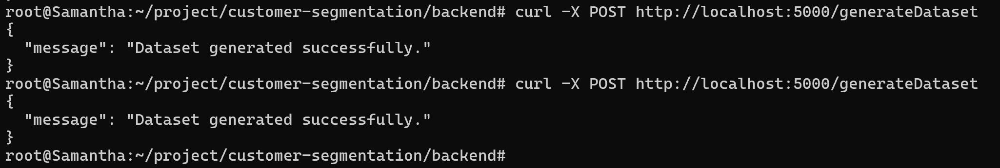

### 2. Get Customers
- URL: /getCustomers
- Method: GET
- Description: Returns all customer data.
- Request Parameters: None
- Response Example:

<pre>[
  {
    "age": 26,
    "annual_income": "148222.50",
    "city": 13,
    "credit_score": 746,
    "customer_id": 1,
    "first_name": "Rozella",
    "last_name": "Jenderer",
    "loan_balance": "4814308.71",
    "occupation": 2
  },
  {
    "age": 36,
    "annual_income": "56243.68",
    "city": 13,
    "credit_score": 521,
    "customer_id": 2,
    "first_name": "Kirby",
    "last_name": "Manring",
    "loan_balance": "3522967.11",
    "occupation": 4
  }
]</pre>  
- HTTP Status Codes:
  - 200 OK 
  - 500 Internal Server Error
- cURL:
<pre>curl -X GET http://localhost:5000/getCustomers</pre>

### 3. Conduct Clustering
- URL: /conductClustering
- Method: POST
- Description: Performs K-Means clustering on the customer dataset and returns the cluster summary.
- Request Body: None
- Response Example:
<pre>{
  "cluster": {
    "0": {
      "age": 48.17836593785961,
      "annual_income": 136263.1024510932,
      "city": 5,
      "credit_score": 574.5696202531645,
      "loan_balance": 2419354.466570771,
      "occupation": 2
    },
    "1": {
      "age": 69.66666666666667,
      "annual_income": 135399.31881944442,
      "city": 13,
      "credit_score": 576.1909722222222,
      "loan_balance": 2491047.7868981482,
      "occupation": 0
    },
    "2": {
      "age": 27.603650586701434,
      "annual_income": 138270.79179921772,
      "city": 8,
      "credit_score": 581.0234680573664,
      "loan_balance": 2495915.9545632335,
      "occupation": 2
    }
}</pre>
- HTTP Status Codes:
  - 200 OK 
  - 500 Internal Server Error
- cURL:
<pre>curl -X POST http://localhost:5000/conductClustering</pre>
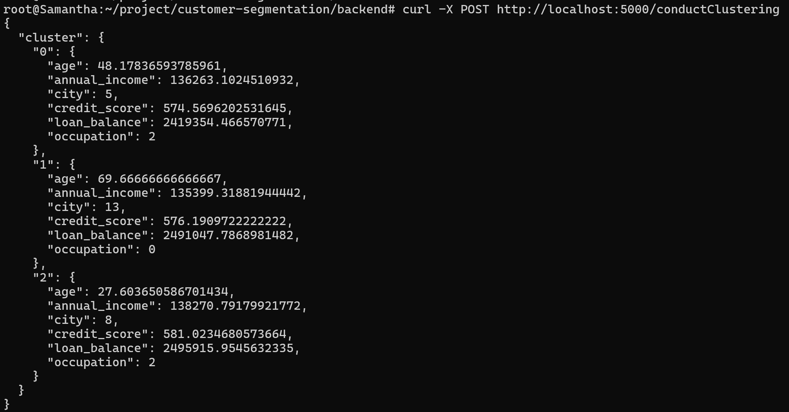

### 4. Get Customers by Cluster
- URL: /getCustomersByCluster
- Method: GET
- Description: Returns all customer data sorted by cluster.
- Request Parameters: None
- Response Example:

<pre>{
  "0": [
    {
      "age": 59,
      "annual_income": "104706.76",
      "city": 11,
      "cluster": 0,
      "credit_score": 629,
      "customer_id": 2,
      "first_name": "Ginevra",
      "last_name": "Tabak",
      "loan_balance": "45564.89",
      "occupation": 3
    },
    {
      "age": 48,
      "annual_income": "136263.10",
      "city": 5,
      "cluster": 0,
      "credit_score": 574,
      "customer_id": 3,
      "first_name": "John",
      "last_name": "Doe",
      "loan_balance": "12345.67",
      "occupation": 1
    }
  ]
}</pre>  
- HTTP Status Codes:
  - 200 OK 
  - 500 Internal Server Error
- cURL:
<pre>curl -X GET http://localhost:5000/getCustomersByCluster</pre>
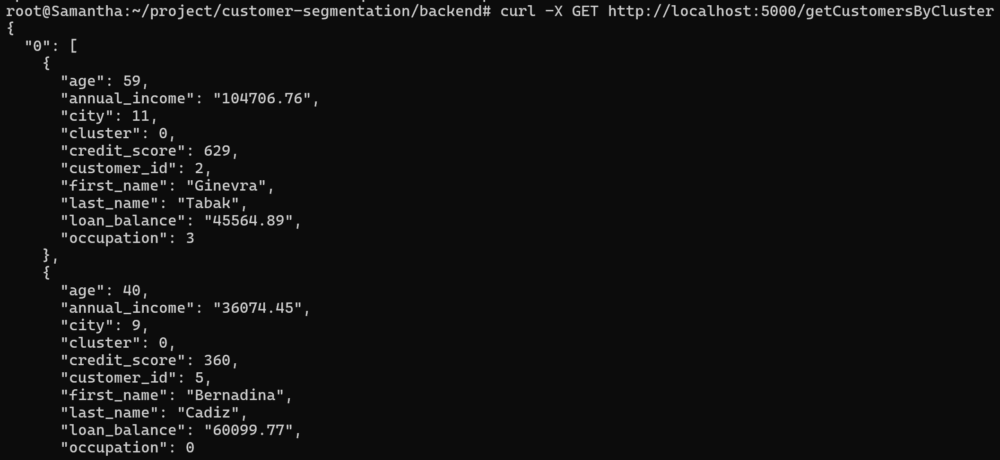

### 5. Get Clusters Amounts
- URL: /getClustersAmounts
- Method: GET
- Description: Returns customer amounts for each cluster.
- Request Parameters: None
- Response Example:

<pre>{
  "0": 119,
  "1": 187,
  "2": 194
}</pre>  
- HTTP Status Codes:
  - 200 OK 
  - 500 Internal Server Error
- cURL:
<pre>curl -X GET http://localhost:5000/getClustersAmounts</pre>
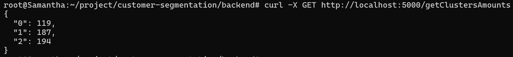

### 6. Get Income And Loan by Cluster
- URL: /getIncomeAndLoanByCluster
- Method: GET
- Description: Returns income and loan balabce by cluster.
- Request Parameters: None
- Response Example:

<pre>{
  "0": [
    {
      "annual_income": "37306.45",
      "customer_id": 4,
      "loan_balance": "89483.05"
    },
    {
      "annual_income": "46240.51",
      "customer_id": 5,
      "loan_balance": "13959.73"
    }]
}</pre>  
- HTTP Status Codes:
  - 200 OK 
  - 500 Internal Server Error
- cURL:
<pre>curl -X GET http://localhost:5000/getIncomeAndLoanByCluster</pre>
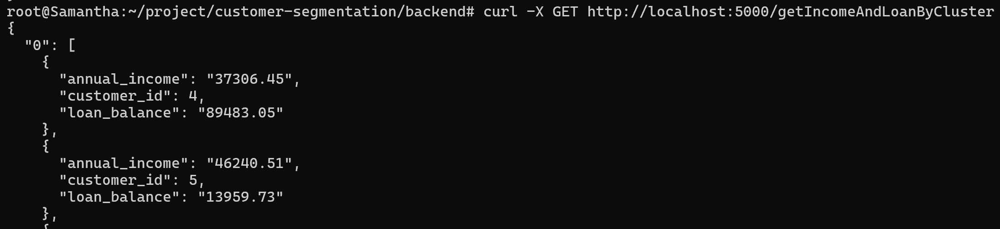

### 7. Generate Product Dataset
- URL: /generateProductDataset
- Method: POST
- Description: Geterate the product dataset.
- Request Parameters: None
- Response Example:

<pre>{
  "message": "Product dataset generated successfully."
}</pre>  
- HTTP Status Codes:
  - 200 OK 
  - 500 Internal Server Error
- cURL:
<pre>curl -X POST http://localhost:5000/generateProductDataset</pre>
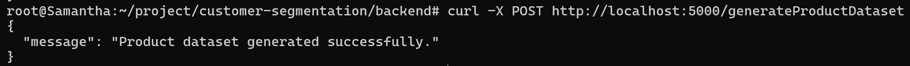

### 8. Get Products
- URL: /getProducts
- Method: GET
- Description: Return product data.
- Request Parameters: None
- Response Example:

<pre>[
  {
    "annual_fees": "359.33",
    "benefits": "Various benefits depending on the product.",
    "channels": [
      "Online",
      "Branch",
      "Mobile App"
    ],
    "credit_score_required": 703,
    "eligibility_criteria": {
      "credit_score_required": 703,
      "max_age": 75,
      "max_income": 159249.09,
      "min_age": 18,
      "min_income": 30232.71
    },
    "interest_rate": "14.55",
    "launch_date": "Mon, 12 Apr 2021 00:00:00 GMT",
    "max_age": 75,
    "max_income": "159249.09",
    "min_age": 18,
    "min_income": "30232.71",
    "product_id": 1092,
    "product_name": "Investment_1092",
    "product_status": "Inactive",
    "product_type": "Investment",
    "renewable": false,
    "reward_points": "9872.00",
    "risk_level": "Medium",
    "term_length": 12
  }
]</pre>  
- HTTP Status Codes:
  - 200 OK 
  - 500 Internal Server Error
- cURL:
<pre>curl -X GET http://localhost:5000/getProducts</pre>
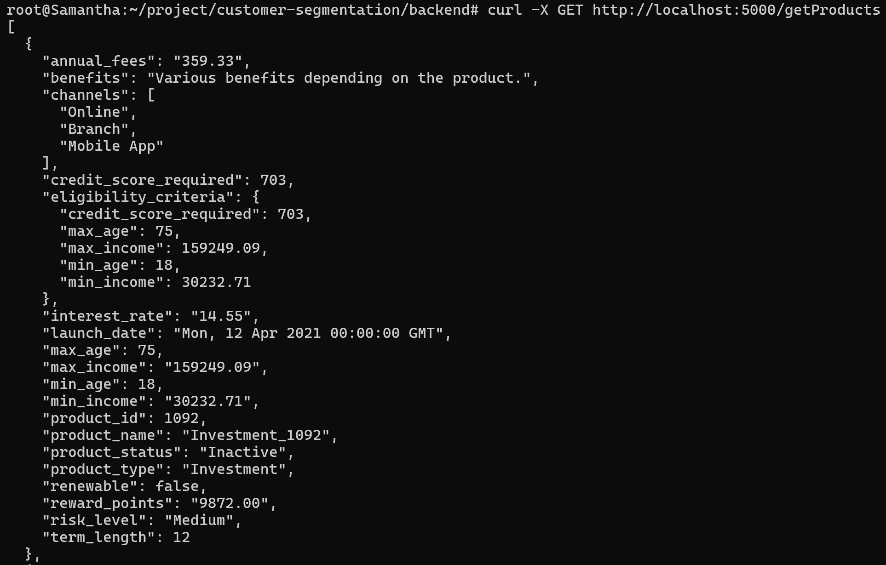

### 9. Conduct Product Match
- URL: /conductProductMatch
- Method: POST
- Description: Match sutiable product options.
- Request Parameters: None
- Response Example:

<pre>{
  "message": "Product matching completed successfully."
}</pre>  
- HTTP Status Codes:
  - 200 OK 
  - 500 Internal Server Error
- cURL:
<pre>curl -X POST http://localhost:5000/conductProductMatch</pre>
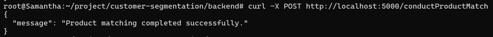

### 10. Get Products By Cluster
- URL: /getProductsByCluster
- Method: GET
- Description: Return products sorted by cluster.
- Request Parameters: None
- Response Example:

<pre>{
{
  "annual_fees": "408.38",
  "benefits": "Various benefits depending on the product.",
  "channels": [
    "Online",
    "Branch",
    "Mobile App"
  ],
  "cluster": [
    0,
    1,
    2
  ],
  "credit_score_required": 800,
  "eligibility_criteria": {
    "credit_score_required": 800,
    "max_age": 67,
    "max_income": 92197.03,
    "min_age": 18,
    "min_income": 34739.27
  },
  "interest_rate": "2.72",
  "launch_date": "Sat, 08 Aug 2020 00:00:00 GMT",
  "max_age": 67,
  "max_income": "92197.03",
  "min_age": 18,
  "min_income": "34739.27",
  "product_id": 2781,
  "product_name": "Credit Card_2781",
  "product_status": "Inactive",
  "product_type": "Credit Card",
  "renewable": true,
  "reward_points": "5733.03",
  "risk_level": "Low",
  "score": "0.906",
  "term_length": 30
  }
}</pre>  
- HTTP Status Codes:
  - 200 OK 
  - 500 Internal Server Error
- cURL:
<pre>curl -X GET http://localhost:5000/getProductsByCluster</pre>

### 11. Select Product By Id
- URL: /selectProductById/<int:product_id>
- Method: GET
- Description: Return products filtered by the product_id.
- Request Parameters: product_id
- Response Example:

<pre>{
{
  "annual_fees": "408.38",
  "benefits": "Various benefits depending on the product.",
  "channels": [
    "Online",
    "Branch",
    "Mobile App"
  ],
  "cluster": [
    0,
    1,
    2
  ],
  "credit_score_required": 800,
  "eligibility_criteria": {
    "credit_score_required": 800,
    "max_age": 67,
    "max_income": 92197.03,
    "min_age": 18,
    "min_income": 34739.27
  },
  "interest_rate": "2.72",
  "launch_date": "Sat, 08 Aug 2020 00:00:00 GMT",
  "max_age": 67,
  "max_income": "92197.03",
  "min_age": 18,
  "min_income": "34739.27",
  "product_id": 2781,
  "product_name": "Credit Card_2781",
  "product_status": "Inactive",
  "product_type": "Credit Card",
  "renewable": true,
  "reward_points": "5733.03",
  "risk_level": "Low",
  "score": "0.906",
  "term_length": 30
  }
}</pre>  
- HTTP Status Codes:
  - 200 OK 
  - 500 Internal Server Error
- cURL:
<pre>curl -X GET http://localhost:5000/selectProductById/<int:product_id></pre>

### 12. Drop Table
- URL: /dropTable/<string:tableName>
- Method: POST
- Description: Drop a table by the table name.
- Request Parameters: tableName
- Response Example:

<pre>{
  "status": "success",
  "table": "ptorducts"
}</pre>  
- HTTP Status Codes:
  - 200 OK 
  - 500 Internal Server Error
- cURL:
<pre>curl -X POST http://localhost:5000/dropTable/<string:tableName></pre>
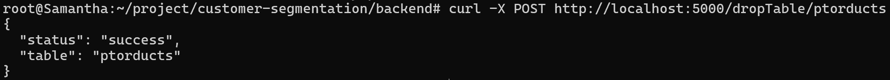

## Schedule Documentation
### 1. Every hour
- /dropTable/customers
- /dropTable/products

## Project Design
### 1. Work Flow & Wireframe
<table>
  <tr>
    <th>Work Flow</th>
    <th>Wireframe</th>
    <th>UIUX</th>
  </tr>
  <tr>
    <td align="center"><b>Miro</b></td>
    <td align="center"><b>Miro</b></td>
    <td align="center"><b>Figma</b></td>
  </tr>
  <tr>
    <td align="center" valign="top">
      
    </td>
    <td align="center" valign="top">
      
    </td>
    <td align="center" valign="top">
      
      
    </td>
  </tr>
</table>

### 2. Prototype: Figma

## Appendixes
### 1. Localhost Demo
#### 1.1 Dataset Generation
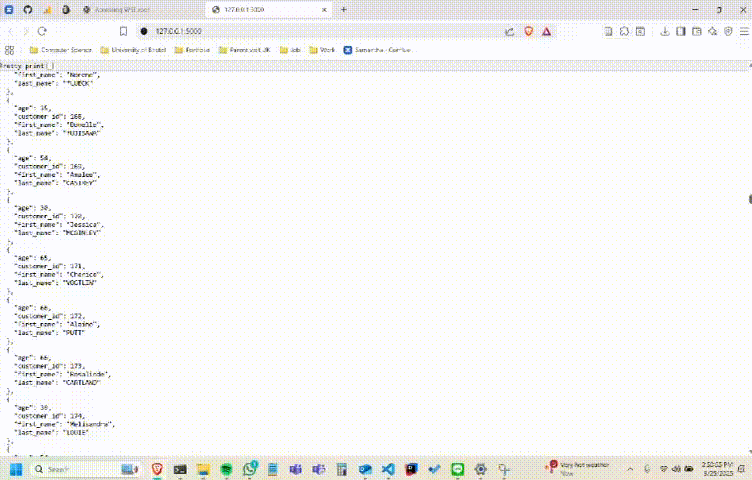
#### 1.2 K-Means Clustering
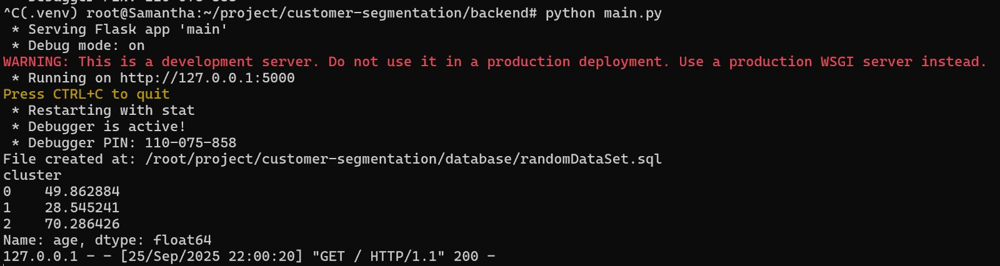
#### 1.3 Home Page Demo

#### 1.4 Select & Result(partial) Page Demo 

#### 1.5 Result Page Demo : Cluster insights and cluster assignments

#### 1.6 Result Page Demo : Overall and cluster assignments

#### 1.7 Result Page Demo : Overall and recommended products

#### 1.8 Send Email Demo : Selected cluster and product info, the email form

