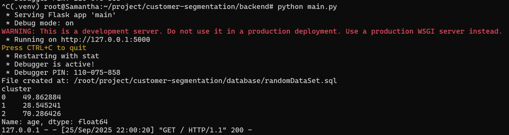
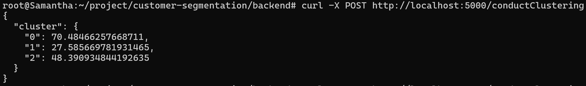

## Table of Contents
- [Project Management](#project-management)
  - [Work Flow & Wireframe](#work-flow--wireframe)
  - [Prototype](#prototype)
- [Project Development](#project-development)
  - [Dataset Generation](#dataset-generation)
  - [K-Means Clustering](#k-means-clustering)
  - [Home Page Demo](#home-page-demo)
- [API Documentation](#api-documentation)
  - [Generate Dataset](#generate-dataset)
  - [Get Customers](#get-customers)
  - [Conduct Clustering](#conduct-clustering)

## Project Management
🔗📝 https://trello.com/b/KH0q9L63/customer-sementation

### Work Flow & Wireframe
<table>
  <tr>
    <th>Work Flow</th>
    <th>Wireframe</th>
    <th>UIUX</th>
  </tr>
  <tr>
    <td align="center"><b>Miro</b></td>
    <td align="center"><b>Miro</b></td>
    <td align="center"><b>Figma</b></td>
  </tr>
  <tr>
    <td align="center" valign="top">
      
    </td>
    <td align="center" valign="top">
      
    </td>
    <td align="center" valign="top">
      
      
    </td>
  </tr>
</table>

### Prototype

## Project Development
### Dataset Generation

### K-Means Clustering

### Home Page Demo

## API Documentation
### Generate Dataset
- URL: /generateDataset
- Method: POST
- Description: Generates a new customer dataset in the database.
- Request Body: None
- Response:
<pre>{
  "message": "Dataset generated successfully."
}</pre>
- HTTP Status Codes:
  - 200 OK 
  - 500 Internal Server Error
- cURL:
<pre>curl -X POST http://localhost:5000/generateDataset</pre>

### Get Customers
- URL: /getCustomers
- Method: GET
- Description: Returns all customer data.
- Request Parameters: None
- Response Example:

<pre>[
  {
    "id": 1,
    "name": "Alice",
    "age": 25,
    "email": "alice@example.com"
  },
  {
    "id": 2,
    "name": "Bob",
    "age": 30,
    "email": "bob@example.com"
  }
]</pre>  
- HTTP Status Codes:
  - 200 OK 
  - 500 Internal Server Error
- cURL:
curl http://localhost:5000/getCustomers

### Conduct Clustering
- URL: /conductClustering
- Method: POST
- Description: Performs K-Means clustering on the customer dataset and returns the cluster summary.
- Request Body: None
- Response Example:
<pre>{
  "cluster": {
    "0": 70.48,
    "1": 27.58,
    "2": 48.39
  }
}</pre>
- HTTP Status Codes:
  - 200 OK 
  - 500 Internal Server Error
- cURL:
<pre>curl -X POST http://localhost:5000/conductClustering</pre>

